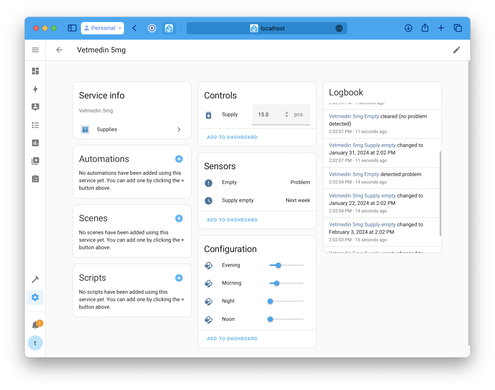

# Inventory Manager for Home Assistant

[](https://github.com/hacs/integration)

A Home Assistant integration for tracking and managing household inventory items with predictive restocking alerts. Perfect for tracking medicines, household supplies, pet supplies, and any consumable items.

## Features

- 📦 **Track Multiple Items**: Create a separate integration instance for each item you want to track
- 📊 **Flexible Consumption Tracking**: Set different consumption rates for different times (morning, noon, evening, night, weekly, monthly)
- 🔮 **Predictive Analytics**: Automatically calculates when you'll run out based on consumption patterns
- ⚠️ **Smart Alerts**: Get advance warnings before supplies run out (configurable threshold)
- 🔄 **Easy Updates**: Simple services to consume items or add new supplies
- 🏠 **Native Integration**: Fully integrated with Home Assistant's automation system

## Use Cases

### Medicine Tracking
Track medication for family members or pets. Set up automations to consume doses at scheduled times and get predictions on when refills are needed.


For example, tracking medicine for our dog Bona (pictured above) who requires multiple medications. The integration automatically tracks consumption and alerts when it's time to reorder.



### Household Supplies
Track consumables like dishwasher tablets, laundry detergent, or coffee pods. Trigger consumption based on appliance usage (e.g., via power monitoring) and never run out unexpectedly.

## Installation

### HACS (Recommended)

1. Open HACS in your Home Assistant instance
2. Click on "Integrations"
3. Click the three dots menu in the top right
4. Select "Custom repositories"
5. Add this repository URL: `https://github.com/nilsreiter/ha-inventory-manager`
6. Select "Integration" as the category
7. Click "Add"
8. Search for "Inventory Manager" in HACS
9. Click "Download"
10. Restart Home Assistant

For detailed HACS custom repository instructions, see the [HACS documentation](https://hacs.xyz/docs/faq/custom_repositories).

### Manual Installation

1. Download the latest release from GitHub
2. Copy the `custom_components/inventory_manager` directory to your Home Assistant's `custom_components` directory
3. Restart Home Assistant

## Configuration

### Adding an Item

1. Go to **Settings** → **Devices & Services**
2. Click **Add Integration**
3. Search for **Inventory Manager**
4. Fill in the configuration form:

| Field | Required | Description | Default |
|-------|----------|-------------|---------|
| **Item Name** | Yes | Name of the item (e.g., "Vetmedin 5mg", "Dishwasher Tabs") | - |
| **Item Size** | No | Size or quantity per package (e.g., 30, 100) | - |
| **Item Unit** | No | Unit of measurement (e.g., "pcs", "tablets", "tabs") | "pcs." |
| **Item Vendor** | No | Manufacturer or vendor name | - |
| **Item Agent** | No | Additional identifier (e.g., active ingredient) | - |
| **Max Consumption** | Yes | Maximum allowed consumption per time slot | 5.0 |
| **Warning Days Before Empty** | Yes | Days before empty to trigger warning | 10 |

5. Click **Submit** to create the item

### Modifying Configuration

To modify an item's configuration:

1. Go to **Settings** → **Devices & Services**
2. Find the Inventory Manager integration instance
3. Click **Configure**
4. Update the desired fields
5. Click **Submit**

## Entities

Each configured item creates multiple entities:

### Number Entities

#### Supply (Required)
- **Entity ID**: `number.<item_name>_supply`
- **Purpose**: Current inventory count
- **Type**: Number input
- **Unit**: Configurable (default: "pcs.")
- **Range**: 0 to 1,000,000
- **Step**: 0.25

#### Consumption Time Slots (Configuration)
These entities define how much is consumed at different times:

- **Morning** (`number.<item_name>_morning`) - Daily morning consumption
- **Noon** (`number.<item_name>_noon`) - Daily noon consumption
- **Evening** (`number.<item_name>_evening`) - Daily evening consumption
- **Night** (`number.<item_name>_night`) - Daily night consumption
- **Week** (`number.<item_name>_week`) - Weekly consumption (disabled by default)
- **Month** (`number.<item_name>_month`) - Monthly consumption (disabled by default)

**Note**: Week and Month entities are disabled by default. Enable them in the entity settings if needed.

All consumption entities:
- **Type**: Number input (Configuration)
- **Range**: 0 to configured max consumption
- **Step**: 0.25
- **Category**: Configuration

### Sensor Entities

#### Empty Prediction
- **Entity ID**: `sensor.<item_name>_supply_empty`
- **Purpose**: Predicts when supply will run out
- **Device Class**: Timestamp
- **Attributes**:
  - `days_remaining`: Calculated days until empty

**Calculation**: Based on current supply and daily consumption rate. Monthly consumption is calculated as per 28 days for prediction purposes.

#### Warning/Problem Indicator
- **Entity ID**: `binary_sensor.<item_name>_warning`
- **Purpose**: Alerts when supply is running low
- **Device Class**: Problem
- **State**: 
  - `On`: Days remaining < configured warning threshold
  - `Off`: Sufficient supply available

## Services

### `inventory_manager.consume`

Reduces the supply count. Use this service in automations when items are consumed.

#### Method 1: Specify Exact Amount

```yaml
service: inventory_manager.consume
data:
  amount: 1
target:
  entity_id: number.dishwasher_tab_supply
```

**Parameters**:
- `amount` (required): Number of items consumed (positive integer)
- `target.entity_id` (required): The supply entity to consume from

**Example Use Case**: Consume one dishwasher tablet each time the dishwasher starts.

#### Method 2: Use Predefined Time Slot

```yaml
service: inventory_manager.consume
data:
  predefined-amount: evening
target:
  entity_id: number.vetmedin_5mg_supply
```

**Parameters**:
- `predefined-amount` (required): Time slot to consume (`morning`, `noon`, `evening`, `night`, `week`, `month`)
- `target.entity_id` (required): The supply entity to consume from

**Example Use Case**: Automatically consume the evening dose of medication at a scheduled time.

#### Method 3: Consume Multiple Items

```yaml
service: inventory_manager.consume
data:
  predefined-amount: evening
target:
  entity_id:
    - number.vetmedin_5mg_supply
    - number.vetoryl_30mg_supply
    - number.vitamin_d_supply
```

**Example Use Case**: Consume multiple medications that are taken together at the same time.

### `inventory_manager.store`

Increases the supply count when new items are added to inventory.

```yaml
service: inventory_manager.store
data:
  amount: 30
target:
  entity_id: number.vetmedin_5mg_supply
```

**Parameters**:
- `amount` (required): Number of items added (positive integer)
- `target.entity_id` (required): The supply entity to add to

**Example Use Cases**:
- Add new supplies after shopping
- Trigger from NFC tag when new package is opened
- Button press when restocking

## Automation Examples

### Example 1: Consume Medication at Scheduled Time

```yaml
automation:
  - alias: "Give Dog Evening Medication"
    trigger:
      - platform: time
        at: "18:00:00"
    action:
      - service: inventory_manager.consume
        data:
          predefined-amount: evening
        target:
          entity_id:
            - number.vetmedin_5mg_supply
            - number.vetoryl_30mg_supply
```

### Example 2: Consume Based on Appliance Usage

```yaml
automation:
  - alias: "Track Dishwasher Tab Usage"
    trigger:
      - platform: state
        entity_id: sensor.dishwasher_status
        to: "running"
    action:
      - service: inventory_manager.consume
        data:
          amount: 1
        target:
          entity_id: number.dishwasher_tab_supply
```

### Example 3: Low Supply Alert

```yaml
automation:
  - alias: "Alert When Medication Running Low"
    trigger:
      - platform: state
        entity_id: binary_sensor.vetmedin_5mg_warning
        to: "on"
    action:
      - service: notify.mobile_app
        data:
          title: "Medication Alert"
          message: "Vetmedin 5mg is running low! Time to reorder."
```

### Example 4: Add Supplies via NFC Tag

```yaml
automation:
  - alias: "Restock Medication via NFC"
    trigger:
      - platform: tag
        tag_id: "medication_restock"
    action:
      - service: inventory_manager.store
        data:
          amount: 30
        target:
          entity_id: number.vetmedin_5mg_supply
      - service: notify.mobile_app
        data:
          message: "Added 30 tablets to Vetmedin inventory"
```

## Troubleshooting

### Entities Not Appearing

- Ensure you've restarted Home Assistant after installation
- Check that the integration was configured successfully in Settings → Devices & Services
- Week and Month entities are disabled by default - enable them in entity settings if needed

### Incorrect Predictions

- Verify that consumption time slots are configured correctly
- Ensure the supply number is accurate
- Remember: Monthly consumption is calculated as consumption per 28 days
- Daily consumption is calculated as: `morning + noon + evening + night + (week/7) + (month/28)`

### Service Not Working

- Verify the entity ID in your service call matches the actual entity
- Ensure you're using the correct service parameter (`amount` or `predefined-amount`, not both)
- Check Home Assistant logs for error messages: Settings → System → Logs

## Contributing

Contributions are welcome! Please see [CONTRIBUTING.md](CONTRIBUTING.md) for guidelines.

## License

This project is licensed under the MIT License - see the [LICENSE](LICENSE) file for details.

## Acknowledgments

Based on the [integration_blueprint template](https://github.com/ludeeus/integration_blueprint).

## Support

- 🐛 **Bug Reports**: [Open an issue](https://github.com/nilsreiter/ha-inventory-manager/issues)
- 💡 **Feature Requests**: [Open an issue](https://github.com/nilsreiter/ha-inventory-manager/issues)
- 📖 **Documentation**: [GitHub Wiki](https://github.com/nilsreiter/ha-inventory-manager)

