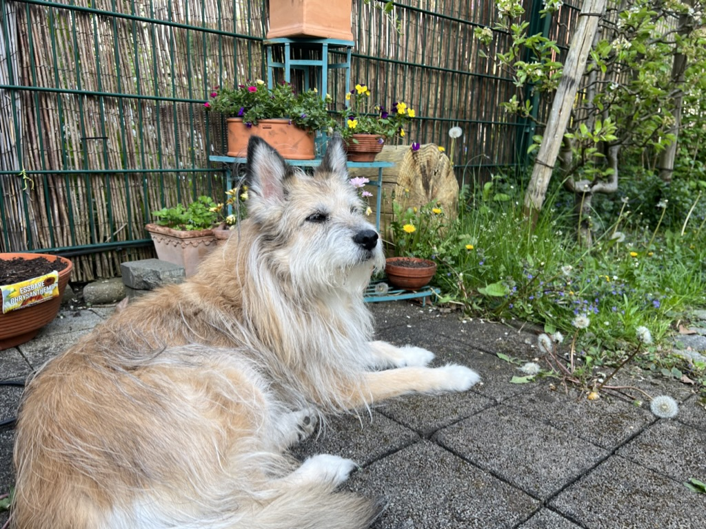

# Track Supply of Specific Things in Home Assistant

This integration is for tracking specific items in your household.

- The component is added once for each item (e.g., dishwasher tabs)
- Each item is represented as a service/device and offers multiple entities
- Supply: How many pieces of the item we have left (entity type `number`)
- Morning/Noon/Evening/Night/Week/Month: How many pieces are regularly consumed (settable in steps of 0.05)?
- Empty: When do we predict the supply to be empty? (sensor of device class `timestamp`). Note that for this purpose, monthly consumption is calculated as per 28 days.
- Soon empty: Do we have to act? (binary sensor of device class `problem`)
- The integration adds two services that can be called regularly (e.g., in the morning) or when specific things happen.
  - The service "consume" reduces the number of items left by the specified amount (this should be run as an automation).
  - The service "store" increases the number of items left. This can be called after groceries have been bought.

## Use Cases

I have devloped this integration with two use cases in mind:

- Track medicine for our dog. Unfortunately, [our dog Bona](img/bona.jpeg) is pretty sick, which means we have to regularly feed her several pills. The integration service is called every morning and evening, and we get a prediction on when it is time to get new supplies. 

- Track dishwasher tabs. Every time the dishwasher starts (tracked via power consumption), our supply of dishwasher tabs is reduced by one. To predict when we run out, we assume that we run it 0.5 times every day.

## Installation

This integration is easiest to install via [HACS](https://hacs.xyz). At this moment, you'll have to add `https://github.com/nilsreiter/ha-inventory-manager` as a custom repository though. To do this, follow [this guide](https://hacs.xyz/docs/faq/custom_repositories).

## Description

The integration provides several entities to track the state and supply levels of things. For each thing, the component stores the number of things we have, together with the prescribed use in the morning, at noon, in the evening and at night. Based on this information, the component predicts when we run out -- this is the state of the main sensor. A second "problem sensor" can signal the need to buy new things before we run out (by default, the sensor signals a problem 10 days before we run out).

To make this really useful, the component adds a service call `inventory_manager.consume`, which can be called to signal that a certain amount of things has been consumed. This updates the supply levels of each consumed thing type.

```yaml
service: inventory_manager.consume
data:
  amount: 1
target:
  entity_id: number.dishwasher_tab_supply
```

It is also possible to consume multiple things at once, and for each thing we consume the predefined amount of things (i.e. if 0.5 pills of one type and 1.5 pills of another type has to be taken):

```yaml
service: inventory_manager.consume
data:
  predefined-amount: evening
target:
  entity_id:
    - number.vetmedin_5mg_supply
    - number.vetoryl_30mg_supply
```

## Back story



This is Bona, our 12 year old dog. Bona is an awesome dog, but unfortunately not very healthy. Thus, we feed her an increasing set of tablets every morning and every evening. Shortly after having started with Home Assistant, I started playing around with ways to track the inventory of Bonas tablets -- in order to timely get new tablets when the old packages get empty.

This essentially can be done with template entities, but it's cumbersome.

```yaml
- unique_id: pills_vetoryl_10mg_daily
  state: >-
    {{ states('input_number.bona_pill_vetoryl10_pro_tag_morgens')|float + states('input_number.bona_pill_vetoryl10_pro_tag_mittags')|float + states('input_number.bona_pill_vetoryl10_pro_tag_abends')|float }}
- unique_id: pills_vetoryl_10mg_vorrat
  device_class: timestamp
  state: >-
    
    {{ predict_pills_state("input_number.bona_pill_vetoryl10", "sensor.template_pills_vetoryl_10mg_daily") }}
  attributes:
    remaining_days: >-
      
      {{ predict_pills_remaining_days("input_number.bona_pill_vetoryl10", "sensor.template_pills_vetoryl_10mg_daily") }}
```

This is an excerpt of my `templates.yaml` file, making use of [custom templates, introduced in 2023.4](https://www.home-assistant.io/blog/2023/04/05/release-20234/). The first entity `pills_vetoryl_10mg_daily` calculates the total daily consumption of a specific tablet type, while the second `pills_vetoryl_10mg_vorrat` predicts when this pill type will be gone.

In addition to these two template entities (for no less than six different tablet types), this requires `input_number` entities for morning, evening and noon, because -- of course -- the dog gets a different combination of tablets every time (and this also changes from time to time).

Because this is very repetitive and makes all my files unreadable, I created this custom component (also, to find out if I could, and because it was fun).
